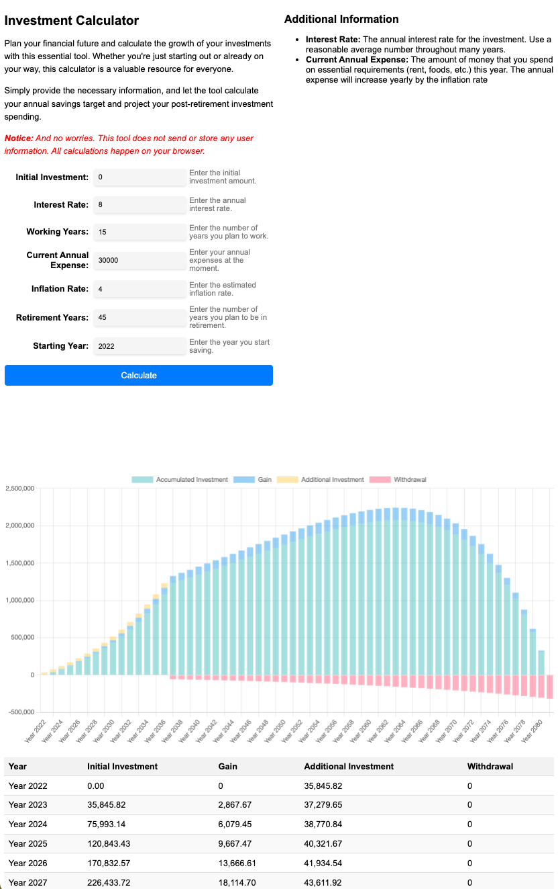

# Retirement Planning Calculator

Retirement is a part of everyone's journey, so why not proactively plan your financial health in advance!

The Retirement Planning Calculator is a web-based tool that helps you plan for your retirement by estimating the required annual investment, investment growth, and retirement expenses based on your inputs. It calculates the minimal required investment, so the assumption is that the whole investment is used up during the retirement.

## Usage

1. Open the Retirement Planning Calculator in a web browser.
2. Fill in the required information in the input fields:
   - Initial Investment: The amount you initially invest.
   - Interest Rate: The annual interest rate for your investment.
   - Investment Duration: The number of years you plan to invest.
   - Additional Annual Investment: The amount you plan to add to your investment each year.
   - Retirement Years: The number of years you plan to be in retirement.
   - Inflation Rate: The annual rate of inflation.
   - Annual Expenses: Your estimated yearly expenses during retirement.
3. Click the "Calculate" button to generate the investment growth chart and retirement expense breakdown.
4. Review the chart and table to visualize how your investment will grow over time and how your retirement expenses will be covered.
5. Adjust the input values as needed to explore different scenarios and see their impact on your retirement plan.

Please note that the Retirement Planning Calculator does not store or send any user information. All calculations are performed locally in your web browser.

## Technologies Used

- HTML
- CSS
- JavaScript
- Chart.js (for chart visualization)

## Deploye website using Terraform

The repository includes also a Terraform module to deploy the program to a static website hosted by AWS S3 and accessed via CloudFront.

The Terraform module requires a domain name hosted on Route53. You need to specify it as the input variable `domain_name` for the `terraform apply` command, e.g.

```bash
terraform apply -var="domain_name=mydomain.example"
```

## Screenshot

